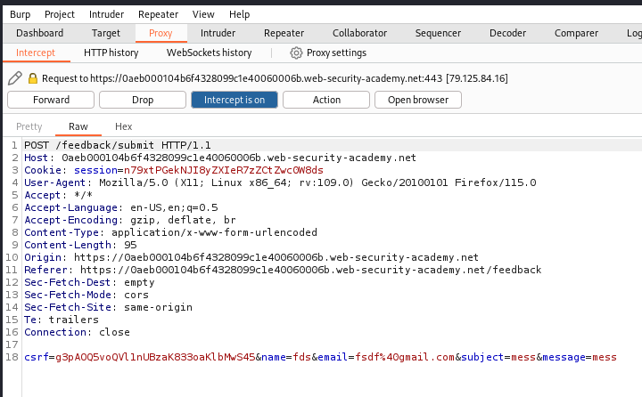

# Blind OS command injection with out-of-band interaction

SE NECESITA BURPSUITE PRO

Vamos al apartado Submit feedback. Ponemos burp a escuchar y rellenamos el formulario

Ahora le damos clic a Burp > Burp collaborator client copiamos lo que nos da

En el campo email ponemos nslookup y a continuación copiamos lo que nos da dado

Y ya estaria

