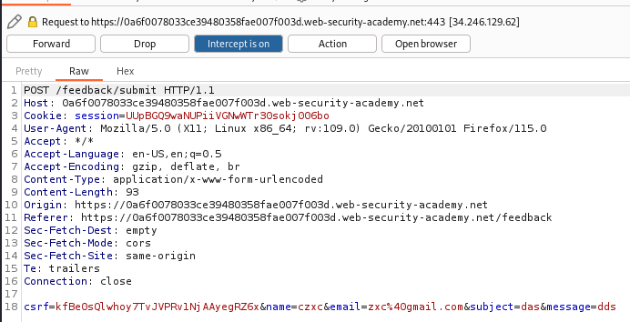

# Blind OS command injection with output redirection

Vamos al apartado Submit feedback. Ponemos a interceptar burp y rellenamos el formulario. 

Ahora tenemos que capturar la salida de whoami y guardarla en la ruta /var/www/images/

||whoami>/var/www/images/output.txt||

Enviamos esto 

Y ahora para verlo vamos a la maquina 

Nos metemos en cualquier articulo, ponemos burp a interceptar y recargamos la pagina. Una vez dentro donde nos sale jpeg lo cambiamos por output.txt

