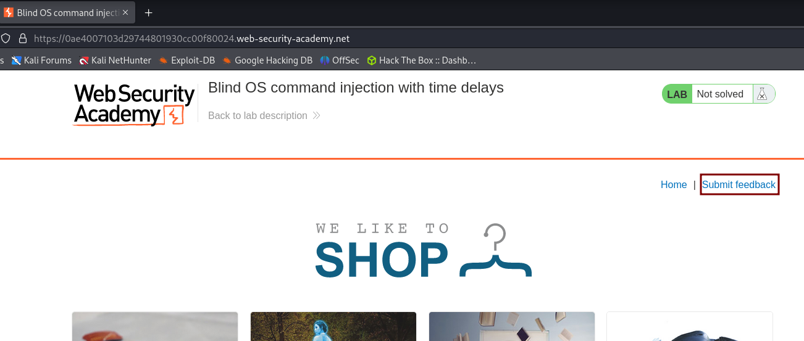

# Blind OS command injection with time delays

Vamos al apartado submit feedback

Ponemos burp a escuchar y rellenamos el formulario

Ahora vamos a mandar el comando que nos ha mandado, un ping con un delay de  10 segundos. Ponemos lo siguiente y le damos a Forward

`||ping+-c+10+127.0.0.1||`

También podemos hacerlo con:

`||sleep+10||`

Ya estaria

