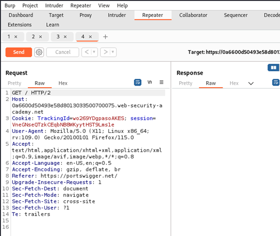

# Blind SQL injection with conditional errors

Entraremos en la maquina ponemos burp a interceptar el trafico y recargamos la pagina. Una vez interceptada la pagina la mandamos al repeater.

Hacemos la siguiente prueba. Con una Comilla.

Ahora hacemos la prueba con dos comillas y vemos que temenos diferentes respuestas. Tenemos un SQLi

Verificamos que en la table users de la base de datos hay un registro llamado administrator

Añadimos el 1 para ver como es de larga la contraseña

Añadimos del 1 al 25 para revisar los caracteres que tiene.

Una vez lanzado vemos que que cambia a partir de 21. Eso signfica que la contraseña tiene 20 caracteres.

Entonces ahora temenos que descubrir uno a uno los caracteres de la contraseña.

En paylodas deberemos meter todas las letras y numeros.

Sacamos el primer caracter.

Ahora deberemos sacar los demas caracteres. Deberemos ir cambiando el numero (hasta 20) para conseguir todos los caracteres.

Una vez tenemos los 20 digitios ya habriamos conseguido la contraseña

