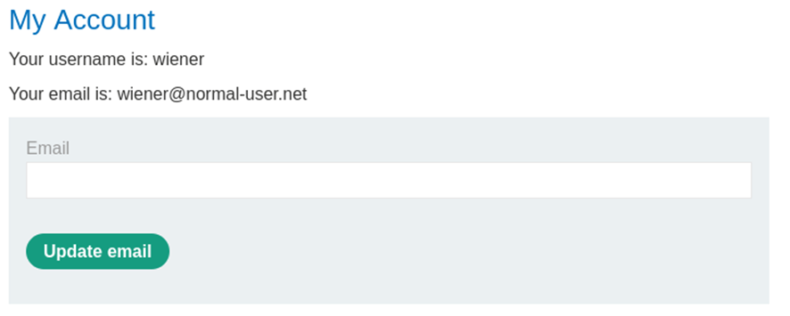

# CSRF vulnerability with no defenses

Ponemos las credenciales que nos da

Rellenamos el campo Email y enviamos y atrapamos con burp

Le damos en el request clic derecho Engagement tools > Generate CSRF Poc (Se necesita Burp pro)

Selccionamos lo siguiente

Copiamos el HTML y cerramos, en la maquina vamos a Go to exploit server

En el body copiamos el HTML que nos ha dado y le damos a stores