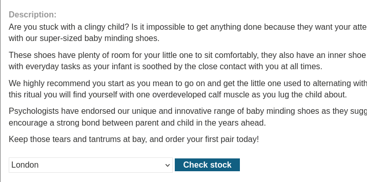

# DOM XSS in document.write sink using source location.search inside a select element

This lab contains a DOM-based cross-site scripting 
vulnerability in the stock checker functionality. It uses the JavaScript
 `document.write` function, which writes data out to the page. The `document.write` function is called with data from `location.search` which you can control using the website URL. The data is enclosed within a select element.

To solve this lab, perform a cross-site scripting attack that breaks out of the select element and calls the `alert` function.

Iniciamos la maquina y nos metemos en un producto, le damos al botón check stock

Sobre el botón le damos clic inspeccionar elemento y buscamos storeid

Escribimos lo siguiente en la URL `productId=1&storeId=abc123` y lo enviamos

Vemos como el desplegable ha cambiado y sale por defecto el que hemos metido.

Si inspeccionamos podemos ver como ha cambiado el codigo.

Ahora en la URL añadimos esto `productId=1&storeId="></select>`

Nos salta la alerta

