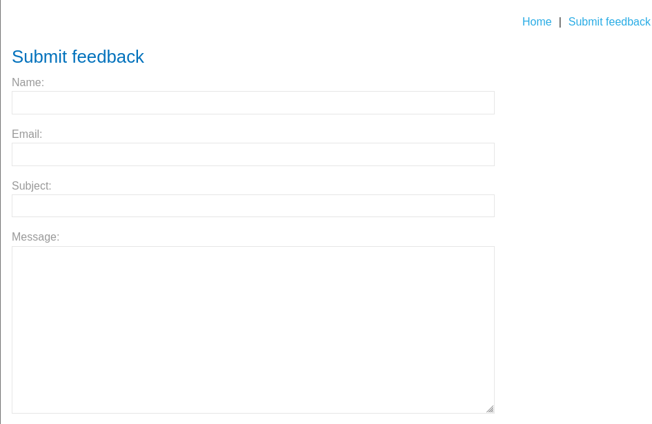

# DOM XSS in jQuery anchor href attribute sink using location.search source

This lab contains a DOM-based cross-site scripting 
vulnerability in the submit feedback page. It uses the jQuery library's `$` selector function to find an anchor element, and changes its `href` attribute using data from `location.search`.

To solve this lab, make the "back" link alert `document.cookie`.

Iniciamos la maquina y vamos al apartado Submit feedback

En la URL añadimos lo siguiente

Vamos a inspeccionar elemento y buscamos lo que acabamos de añadir

volvemos a la URLy añadimos lo siguiente `javascript:alert(1)`

