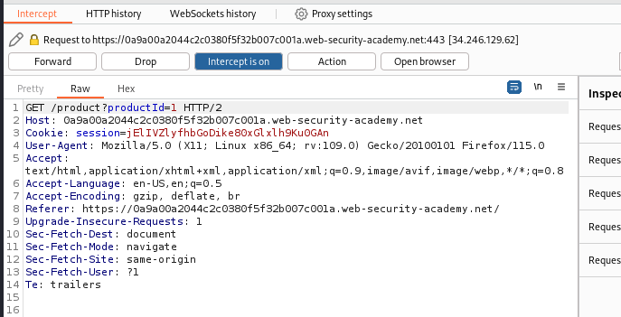

# File path traversal, simple case

This lab contains a path traversal vulnerability in the display of product images.

To solve the lab, retrieve the contents of the `/etc/passwd` file.

Inicamos la maquina, ponemos burpsuite a interceptar y accedemos a un post.

Tenemos que darle al Forward hasta que nos salta este paquete. Lo mandamos al repeater

Ponemos lo siguiente en el apartado filename. Y podemos ver el archivo passwd

Y recargamos la maquina

