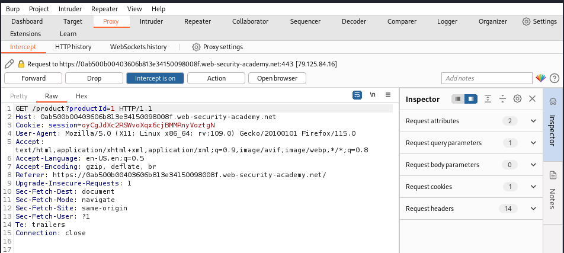

# File path traversal, traversal sequences stripped non-recursively

Iniciamos la maquina, ponemos burp a interceptar y entramos en un post.

Ahora le damos a Forward hasta poder atrapar este paquete. Y lo mandamos al repeater

Ponemos lo siguiente ….//….//….//etc/passwd. Ponemos 4 puntos ya que nos borra 2

Y recargamos la pagina

