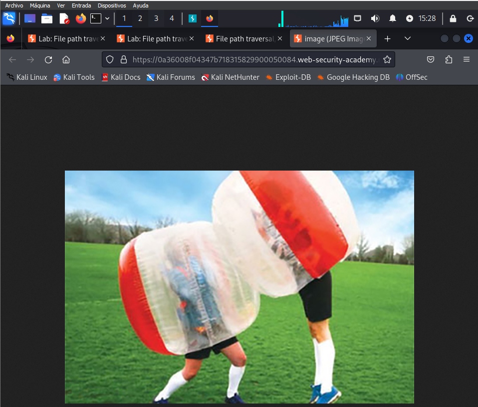

# File path traversal, traversal sequences stripped with superfluous URL-decode

This lab contains a path traversal vulnerability in the display of product images.

The application blocks input containing path traversal 
sequences. It then performs a URL-decode of the input before using it.

To solve the lab, retrieve the contents of the `/etc/passwd` file.

Inicializamos la maquina y en una imagen la abrimos en nueva pestaña.

Ponemos burpsuite a interceptar y recargamos la pagina. Una vez tenemos el paquete lo enviamos al repeater

Ahora deberemos selecionar la / y en la encodeamos (clic derecho Convert selection > URL > URL encoded all characters)  en base64 y una vez la tengamos tenemos que encodear el %

