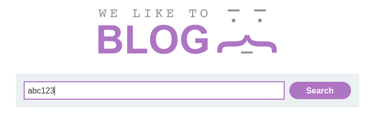

# Reflected XSS into attribute with angle brackets HTML-encoded

This lab contains a reflected cross-site scripting vulnerability in the 
search blog functionality where angle brackets are HTML-encoded. To 
solve this lab, perform a cross-site scripting attack that injects an 
attribute and calls the `alert` function.
        
Arrancamos la maquina y en formulario introducimos un dato

Verificamos que se nos ha introducido el datos que  hemos metido, viendo el codigo de la pagina

Salimos y volvemos al formulario y ponemos `"onmouseover="alert(1)`

Vemos que nos salta la alerta

Y lo tenemos

