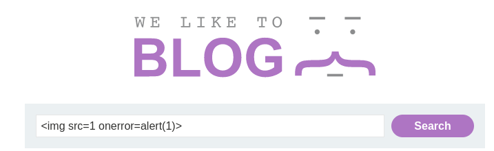

# Reflected XSS protected by CSP, with CSP bypass

This lab uses CSP and contains a reflected XSS vulnerability.

To solve the lab, perform a cross-site scripting attack that bypasses the CSP and calls the `alert` function.

Please note that the intended solution to this lab is only possible in Chrome.

Accedemos a la maquina, arrancamos burpsuite y ponemos para interceptar y en el formulario ponemos lo siguiente. ``

Una vez la tenemos atrapada. En burpsuite la mandamos otra vez al repeater

Podemos ver que la tenemos aqui

En la maquina modificamos la url y a continuación ponemos la siguiente `?search=%3Cscript%3Ealert%281%29%3C%2Fscript%3E&token=;script-src-elem%20%27unsafe-inline%27`

Una vez cargada la URL recargamos la pagina, nos salta la alerta y ya lo tendríamos

