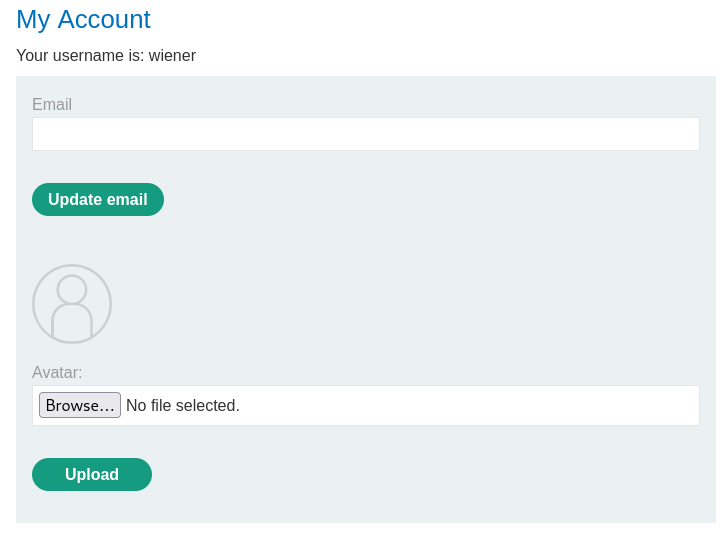

# Remote code execution via web shell upload

Nos logueamos con las credenciales que nos han dado. `wiener:peter`

Subimos una imagen de prueba

En burp deberemos habilitar que nos muestre tambien images. Los mandamos al repeater

Modificamos

Y lo enviamos

Ahora con el otro paquete que hemso ebviado al repeter

