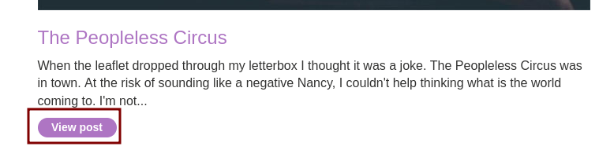

# Stored DOM XSS

This lab demonstrates a stored DOM vulnerability in the blog comment 
functionality. To solve this lab, exploit this vulnerability to call the
 `alert()` function.
		
Accedemos a la maquina y entramos a un post. 

Bajamos hasta el formulario y en el apartado comment ponemos lo siguiente `<>`

Nos sale que se ha guardado el comentario

Volvemos atrás y nos salta la alerta

