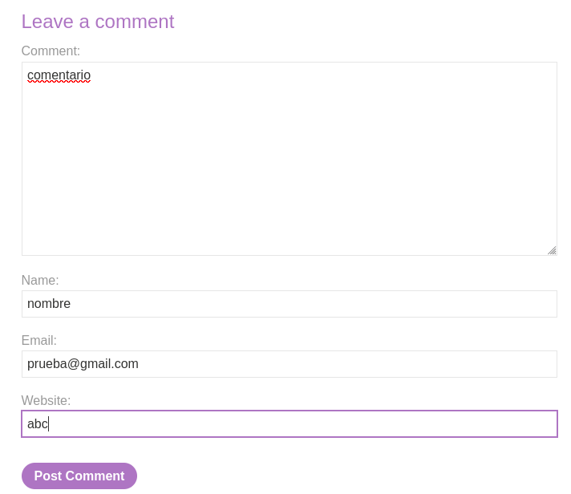

# Stored XSS into anchor href attribute with double quotes HTML-encoded

This lab contains a stored cross-site scripting vulnerability in the 
comment functionality. To solve this lab, submit a comment that calls 
the `alert` function when the comment author name is clicked.
        
Accedemos al laboratorio y accedemos a un post. Ponemos burpsuite a escuchar. Y rellenamos el formulario

Interceptamos el paquete y lo mandamos al repeater, ya que lo usaremos luego 

Como vemos en la maquina se nos ha añadido

Ponemos burpsuite a escuchar y hacemos clic sobre el nombre de usuario del comentario que hemos añadido

El paquete que hemos interceptado lo mandamos al repeater. Tenemos los dos paquetes

Añadimos lo siguiente `javascript:alert(1)` y lo enviamos

Podemos ver que se nos ha añadido un ultimo comentario que si hacemos clic sobre el nos salta la alerta

