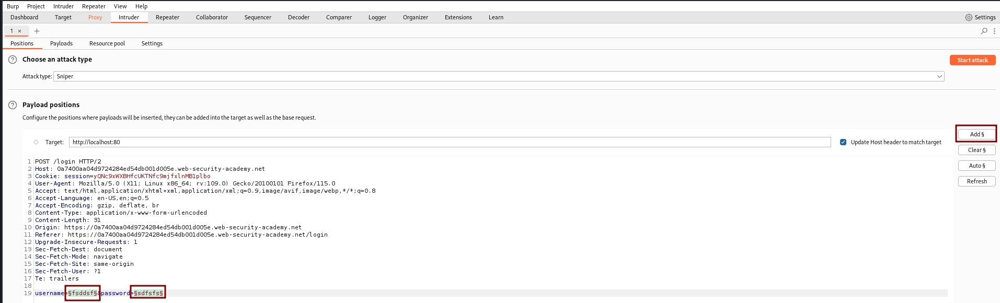

# Username enumeration via response timing

Fuerza bruta 

Atrapamos la solicitud y selecionamos lo que hemos rellenado en user y pass y lo añadimos. AÑDIMOS primero solo el usuario para comprobar cual es

Ahora en payloads le copiamos el diccionario y lanzamos el ataque

Podemos ver que todos nos devuelve codigo 200. Aunque no haya sido correcta la utenticación. Debemos fijarnos en Length, le damos clic al usuario y podemos ver la respuesta. En todos da incorrect user menos en este

Hacemos el mismo proceso poniendo user porque era el usuario que hemos encontrado y ahora probamos la contraseña y nos da la contraseña

Otro ataque diferente. Ahora vamos a añadir en Settings el error de Invalid user and password.

Vemos que hay uno que es diferente

Ahora buscamos la contraseña

**Username enumeration via response timing**

Nos da un usuario y una contraseña. Atrapamos el user y pass lo mandamos al Repeater

Copiamos esto

Lo copiamos aqui

Y en el request ponemos esto y vamos cambiando de uno en uno

Lo mandamos al intruder

Ahora vamos a Payloads y en tipo ponemos numbers

Y aqui ponemos pitchfork

Volvemos a paylodas y ponemos en el 2

Lanzamos el ataque y en los reslutados debemos ir a Columns y añadir response. Y vemos que hay un usuario que destaca

Volvemos y limpiamos

Y ponemos el diccionario de contraseña y lanzamos

